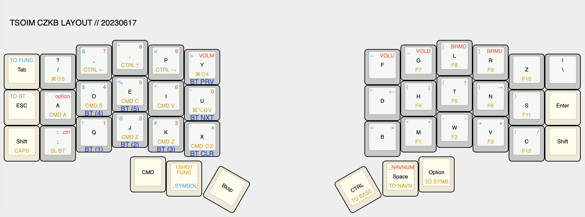

# ZMK config for Corne-ish Zen keyboard



Read the [keyboard tour](docs/tour.md) to learn more!

## repo setup

* [official Corne-ish Zen repo](https://github.com/LOWPROKB/zmk-config-zen-2)
* this repo was set up as a private fork following [these instructions](https://gist.github.com/0xjac/85097472043b697ab57ba1b1c7530274)
* to update:

```
git fetch upstream
git rebase upstream/main
```

## building firmware

1. Edit keymaps and push changes.
2. Click "Actions" in the main navigation, and in the left navigation click the "Build" link.
3. Select the desired workflow run in the centre area of the page (based on date and time of the build you wish to use). You can also start a new build from this page by clicking the "Run workflow" button.
4. After clicking the desired workflow run, you should be presented with a section at the bottom of the page called "Artifacts". This section contains the results of your build, in a file called "firmware.zip"
5. Download the firmware zip archive and extract the two `.uf2` files. They are named according to which side they need to be flashed to.
6. Flash the firmware to your keyboard by double-clicking the reset button to put the it in bootloader mode. A window should pop up showing the contents of the storage on the keyboard. Drag and drop the correct `.uf2` file into the window. When the upload is complete the window will close and the keyboard will exit bootloader mode.
    - If you only changed [the keymap file](/config/corneish_zen.keymap) you only need to flash the left side firmware to the left side.
    - If you changed [the conf file](/config/corneish_zen.conf) you should flash both sides their respective files.

## debugging

### flashing firmware

* try a USB-B to USB-C cable if device not showing up
* double click reset button to set to DFU

### pairing bluetooth

* if device shows as connected but no keystrokes are sent,
    try clearing the bluetooth connection on both keyboard and host device
