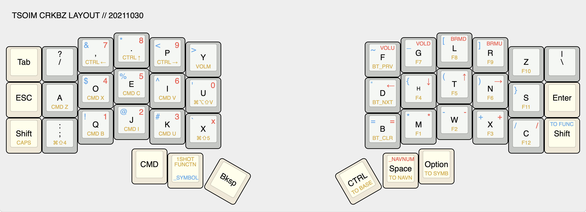
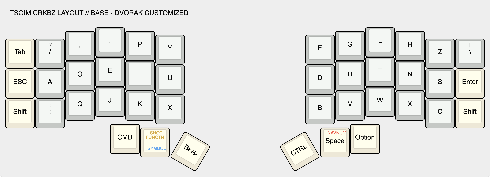
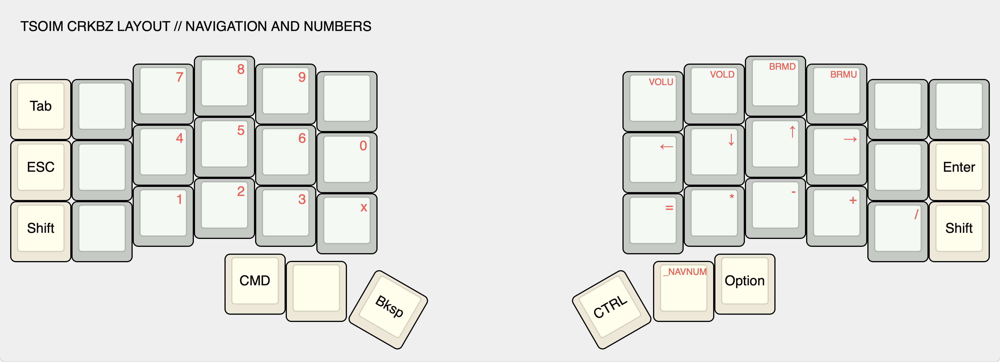
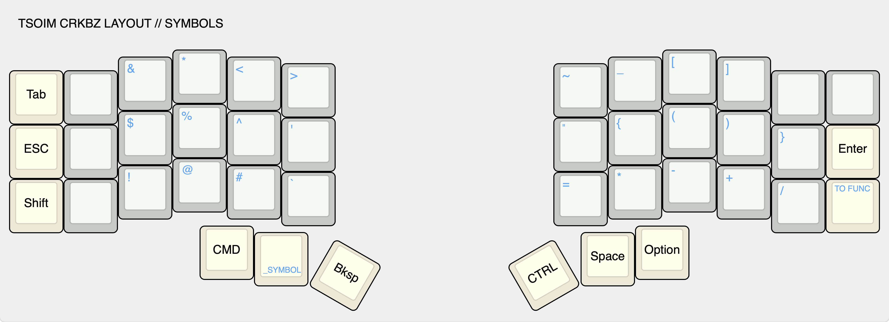
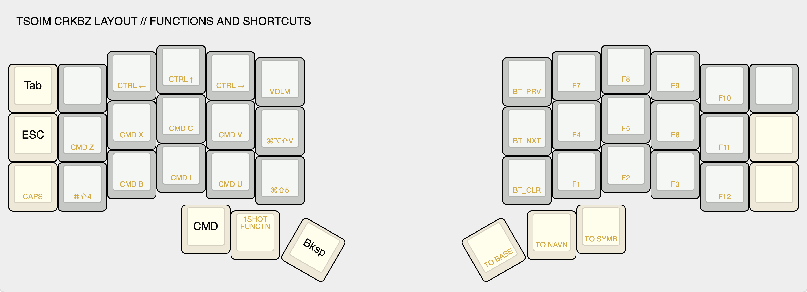

# keyboard tour

## overview

### features

* 4 main layers - base, navigation/numbers, symbols, and functions
* navnum and symbol layers are reachable by holding down thumb keys
* function layer is to be triggered via one-shot tap on left thumb key

### some thoughts

* at some point I came across an internet stranger saying that the layout should adapt to you, not vise versa
* so as I tested new layouts, if I kept mistyping something, I just altered the layout to what my fingers were actually pressing

---

## base layer

### layout

tldr; a modified dvorak layout with `U`/`I` swapped and `C`/`L`/`Z` rotated

* when I started on my ortho-split journey, I figured I might as well try a completely new layout
    so that I retain the muscle memory for qwerty on a traditional keyboard
* for some reason I kept mistyping `U` and `I` - I figured I would only really type dvorak on my own keebs
    so it doesn't matter that I'm using a non-standard dvorak, so I swapped the keys
* `L` and `C` were swapped originally because I needed `ls` to be comfortable considering how often I use it
* `C` and `Z` were then swapped because top right pinky was much harder for me to reach
* unfortunately, even though `Z` is used infrequently in the English language, I had forgotten
    that I use it extensively in vim commands. but `C` was overall more used so for now I just deal with it

### layers

* thumb keys are used to manipulate layers
* navnum and symbol layers are reachable by holding down thumb keys
* function layer is to be triggered via one-shot tap on left thumb key

---

## navnum layer

tldr; access via hold on right thumb key for numpad and arrows

### navigation

* arrow keys live in qwerty `HJKL` positions
    * better alternative than trying to actually use `HJKL` in dvorak positions or to remap vim commands
    * bonus - there's now vim-like navigation everywhere!
* threw in volume and brightness controls

### numbers

* numpad layout with `x` for hex codes
* arithmetic symbols on right for when this layer is locked to be used as a calculator mode

---

## symbol layer

tldr; access via hold on left thumb key for any symbol not accessible on base layer

### shift-num symbols

* symbols normally accessible by pressing shift + number are placed in corresponding spots of numpad layer
* may not be most ergonomic but less brain gymnastics
* arithmetic symbols are also placed in same spots as in navnum layer

### other symbols

* `()`, `{}`, and `[]` are placed as pairs surrounding home positions
* the rest were just kind of filled in to wherever made sense to me tbh

---

## function layer

tldr; access via one-shot tap on left thumb key for shortcuts and function keys

### shortcuts

* these shortcuts are just hard to reach with how the layers are set up,
    some could probably be replaced with sticky keys with mods but that requires more learning
* to make sure symbols layers take precedence over function keys when typing quickly
    (mainly `-` for command line flags), the `hold-preferred` flavor was selected for `behavior-hold-tap`

* top row: desktop navigation - desktop switching + mission control
* home row: editing - undo, cut, copy, paste, paste and match destination format
* bottom row: text formatting + screenshotting

### layer toggle on

* right thumb keys are used to turn on base, navnum, or symbol layers
    * these keys don't have a corresponding function in symbol layer, see `hold-preferred` comment above
* function layer needs to be turned on in symbols layer
    * `TO` doesn't seem to take effect when selected via sticky layer
        * my guess is the sticky layer is just released after term expires

### misc

* the zmk bluetooth keys to cycle to prev or next connection, or to clear a connection were included
* I personally don't really use function keys so I left them on this layer
