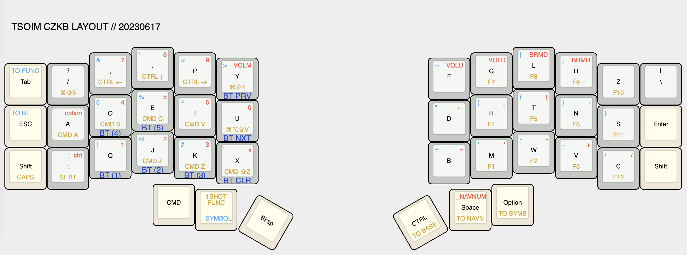
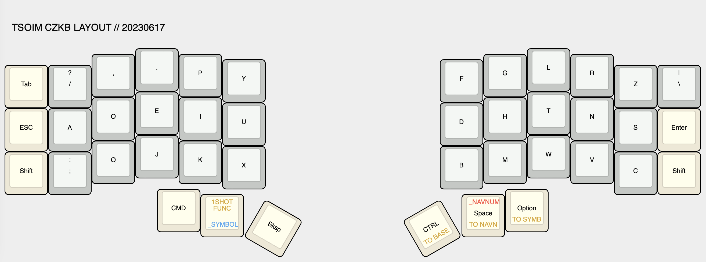
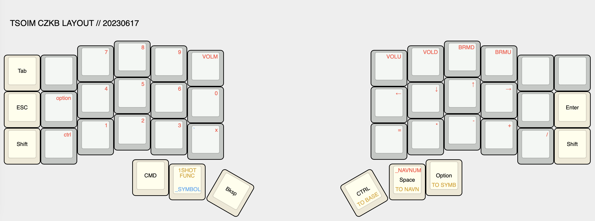
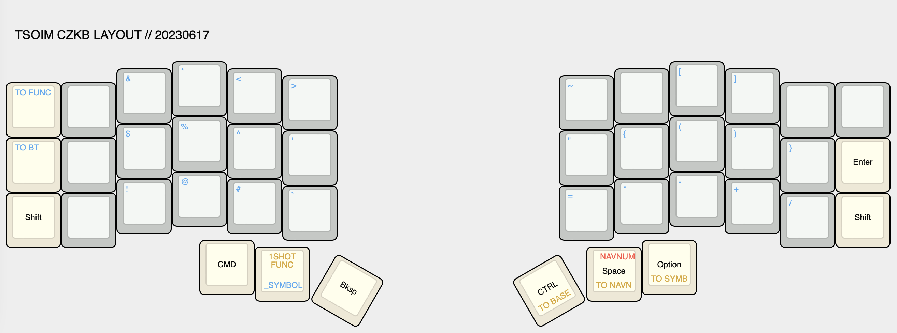
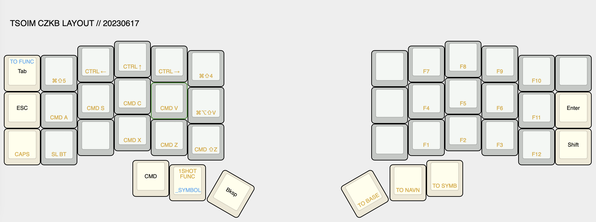
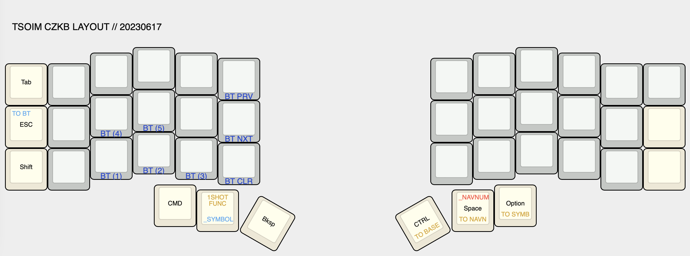

# keyboard tour

## overview

### highlights

* [Corne-ish Zen keyboard](https://github.com/LOWPROKB/zmk-config-Zen-2) with ZMK firmware
* 5 layers - base, navigation/numbers, symbols, functions, and bluetooth
* base layer is a customized version of dvorak that suits my fingers better
* navigation/numbers and symbols layers are reachable by holding down thumb keys,
    with the "core" functionality for each layer on the opposite hand
* functions/shortcuts layer to be used with one-shot tap on left thumb key
* bluetooth layer to manage bluetooth connections

--

## moving around layers

### momentary and sticky layers

* navnum and symbols layers are most used and may need continuous access,
    so they are reachable by holding down thumb keys (momentary layer) while on default layer

* the left thumb key is used to access multiple layers: hold for symbols layer,
    tap for one-shot (sticky) functions layer to access shortcuts
* to make sure symbols layers take precedence over function keys when typing quickly
    (mainly `-` for command line flags), the `hold-preferred` flavor was selected for `behavior-hold-tap`

* bluetooth layer should not be easily accessed, so it is gated by two keypresses
    and is triggered via one-shot tap (sticky layer) while on functions layer

### toggle on layers

* from the functions layer: base, navnum, and symbols layers can be turned on
    * these keys are transparent on all layers so can always go back to base layer from any layer
* from the symbols layer: function and bluetooth layers can be turned on
    * I tried to create `TO` layer on those layers (e.g. `TO FUNCTION` while on functions layer),
        but it doesn't seem to take effect when selected via sticky layer
    * my guess is the sticky layer is just released after term expires,
        so I moved the access for these to be on symbols layer
        (hold thumb key + press instead of tap thumb key + press)

---

## base layer

### layout

tldr; a modified dvorak layout with `U`/`I` swapped and `C`/`L`/`Z` rotated

* when I started on my ortho-split journey, I figured I might as well try a completely new layout
    so that I retain the muscle memory for qwerty on a traditional keyboard
* for some reason I kept mistyping `U` and `I` - I figured I would only really type dvorak on my own keebs
    so it doesn't matter that I'm using a non-standard dvorak, so I swapped the keys
* `L` and `C` were swapped originally because I needed `ls` to be comfortable considering how often I use it
* `C` and `Z` were then swapped because top right pinky was much harder for me to reach
* unfortunately, even though `Z` is used infrequently in the English language, I had forgotten
    that I use it extensively in vim commands. but `C` was overall more used so for now I just deal with it

---

## navigation/numbers layer

tldr; access via hold on right thumb key for numpad and arrows

### navigation (and controls)

* arrow keys live in qwerty `HJKL` positions
    * better alternative than trying to actually use `HJKL` in dvorak positions or to remap vim commands
    * bonus - there's now vim-like navigation everywhere!
* threw in volume and brightness controls
* option and control keys added to left keyboard for when right thumb is holding down to access this layer

### numbers

* numpad layout with `x` for hex codes
* arithmetic symbols on right for when this layer is locked to be used as a calculator mode

---

## symbols layer

tldr; access via hold on left thumb key for any symbol not accessible on base layer,
can toggle on to function or bluetooth layer

### shift-num symbols

* symbols normally accessible by pressing shift + number are placed in corresponding spots of numpad layer
* may not be most ergonomic but less mental gymnastics
* arithmetic symbols are also placed in same spots as in navnum layer

### other symbols

* `()`, `{}`, and `[]` are placed as pairs surrounding home positions
* the rest were just kind of filled in to wherever made sense to me tbh

---

## functions/shortcuts layer

tldr; access via one-shot tap on left thumb key for shortcuts and function keys

### shortcuts

* the shortcuts were designed to be accessible with left hand only while mousing
* top row: desktop switching, mission control, screenshot controls
* home row: select all, save, copy, paste, and paste and match destination format
* bottom row: cut, undo, redo

### misc

* personally don't really use function keys so left them on this layer in a numpad-ish fashion
* had bold, italicize, and underline shortcuts for a while, but removed because unused

---

## bluetooth layer

tldr; access via one-shot tap on functions layer

### layout

* zmk bluetooth keys to select connection target (to switch among computers quickly)
* zmk bluetooth keys to cycle to prev or next connection, or to clear a connection

---

## some thoughts

* at some point an internet stranger said that the layout should adapt to the person, not vise versa
* so as I tested new layouts, if I kept mistyping something, I just altered the layout to what my fingers were actually pressing

---

## notes

* [keyboard layout editor](http://www.keyboard-layout-editor.com/#/gists/052b74409d9075edf47ff1b15d0820e1)
